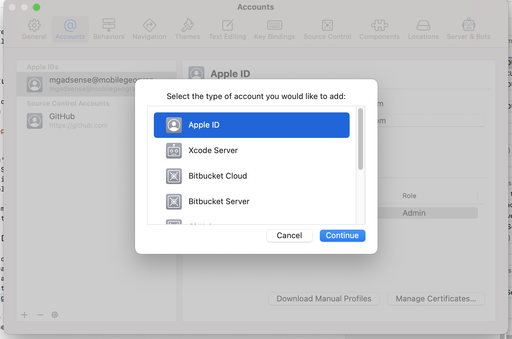
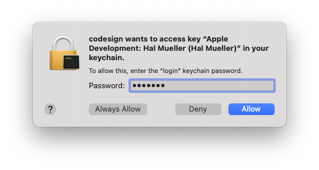
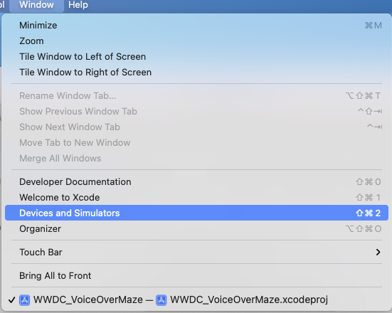
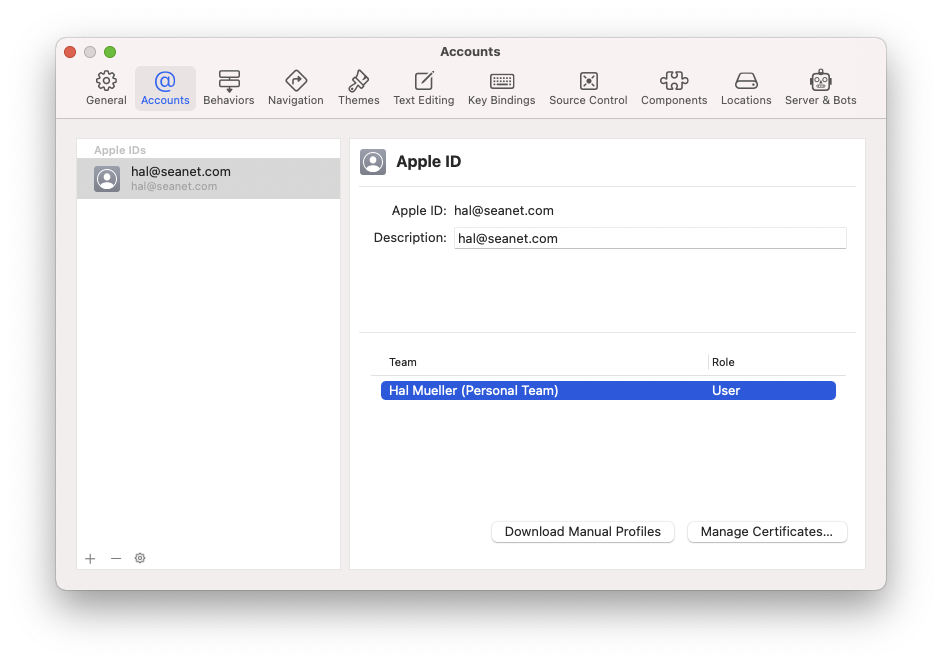
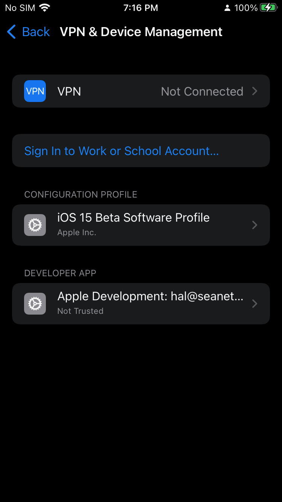
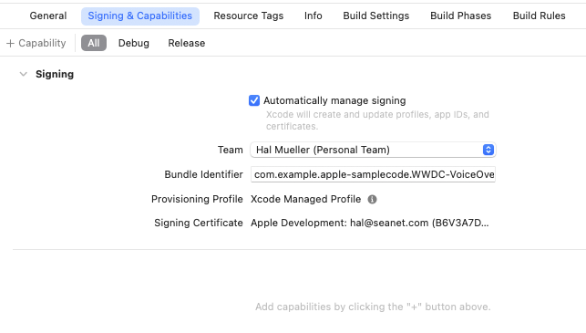
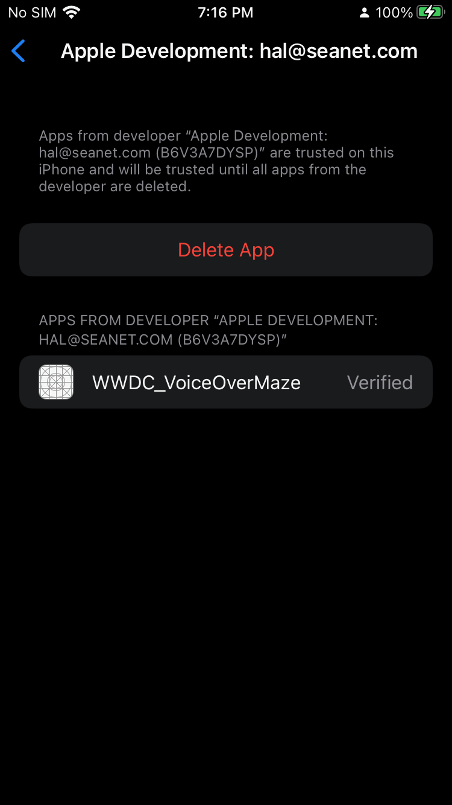
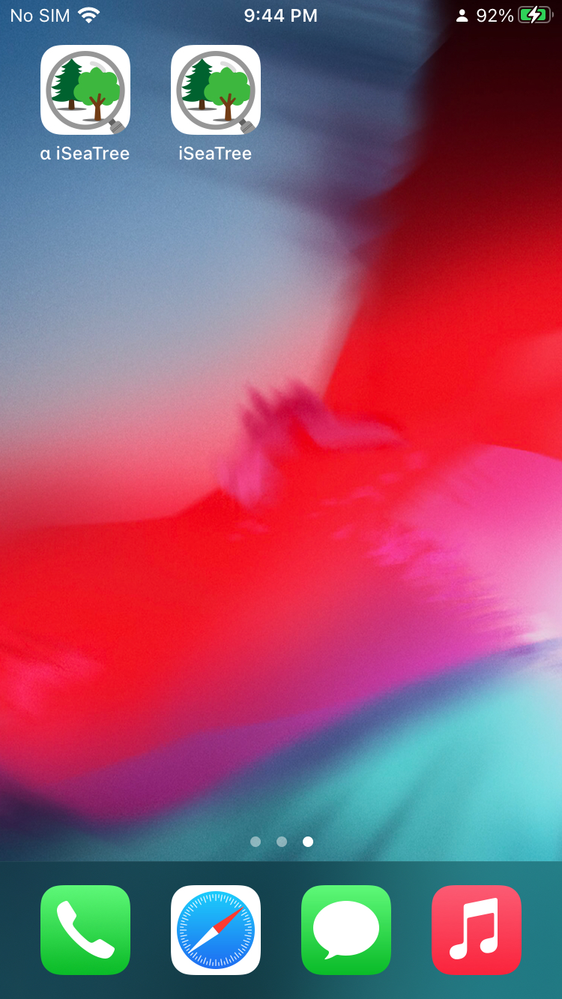
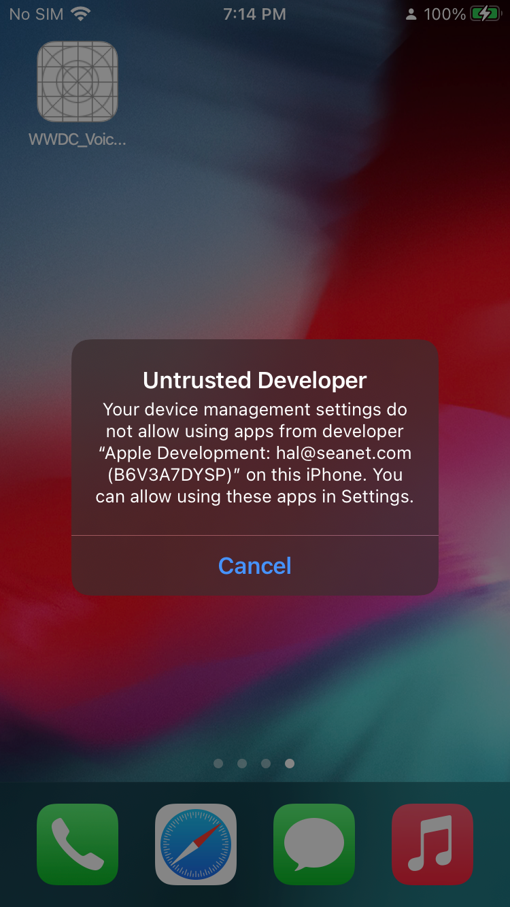
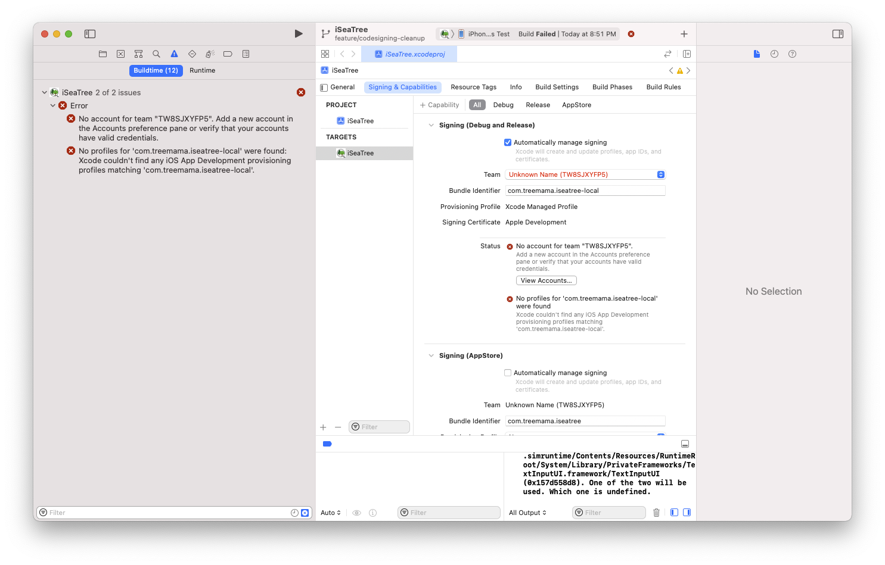

# Building for iOS

## The High Points (for experienced iOS developers)

We use an individual account when  building for the App Store, not an organizational one. That means you have to change the development team in 
Xcode to use your own credentials, if you want to build locally. Please _do not_ commit that `.xcodeproj` change to the repository.

Cocoapods are updated at the repository level. Do not run any Cocoapods commands unless you're addressing a specific issue. See [https://guides.cocoapods.org/using/using-cocoapods.html](https://guides.cocoapods.org/using/using-cocoapods.html) for discussion of pros/cons of doing it this way. We have chosen to commit Cocoapods to make it easier for a volunteer who isn't an iOS developer to contribute.

You do not need to have Cocoapods installed to build this project.

Use the `iSeaTree` scheme for building to device or simulator, and uses a different bundle identifier that the production/TestFlight iSeaTree. The `iSeaTree-AppStore` scheme is for app store submissions.

## Just Enough Xcode

This section is for people who aren't usually iOS developers, and want to stick to JavaScript work, without tripping over the Apple details. Xcode is the IDE (Integrated Development Environment)
used for building iOS, Mac, tvOS, and Apple Watch apps. We're going to get you up and running without bogging you down in minutiae.

## Machine and Account Setup

You need to have Xcode installed on your Mac if you're going to build this project. You must use a Mac if you're building for iPhone/iPad. You can download Xcode from
the Mac App Store at this link: [https://apps.apple.com/us/app/xcode/id497799835?mt=12](https://apps.apple.com/us/app/xcode/id497799835?mt=12). It's free.

You also need an Apple ID. If you're a typical Mac user, you already have one and you're using it for iCloud and Mac App Store, maybe iOS App Store, maybe Music or TV/Movies.
You have to set this Apple ID up in the Apple Developer Program, at the free tier. Here's how:
* Sign in on [https:developer.apple.com[(developer.apple.com). Use your regular password.
* Agree to the license terms.
* Do not Enroll in the dev program. That opetion would charge you $99 for a membership, and you don't need to do that. The free tier works just fine.

## Application and Mobile Device Setup

Apple has an elaborate system of cryptographic code signing, in order to make sure only known, vetted software is installed on your iPhone. Usually for iPhones, that software
comes through the iOS App Store, after a review by Apple. For development purposes, we will sign the code right on our Mac, and install it directly to our iPhone, bypassing Apple.
That means we have some hoops to go through.

Every iOS or Mac app has a bundle identifier. For iSeaTree, it's `com.treemama.iSeaTree`. That bundle ID  determines the unique identity of the application and all of its data.
We will use an additional identifier, `com.treemama.iSeaTree-local`, for the version we build that has not gone through Apple app review. There's also a cryptographic certificate
associated with the creator of the app (either Treemama, or you as an individual developer). And then there's the issue of trusting that certificate. It's automatically trusted if
the app was signed by Apple, but if it's signed by an individual developer, we need an extra step to allow the iPhone to trust that certificate. A certificate is tied to a development team.
For an individual developer, that "team" is you!

Here are the steps you need to follow to let your iPhone trust the software you will build.

* Launch Xcode, and open (command-O) `ios/iSeaTree.xcworkspace`. Make sure you open the `.xcworkspace` file, not the `.xcodeproj` file.
* Register your Apple ID with Xcode. Open Xcode preferences (command-,), click Accounts, and add your ID. 
* Select the iSeaTree target in the Xcode project browser. Change the team name to match your own name (listed in the popup as Individual Developer).
* When the popup challenge appears, allow Xcode to read your Keycahin ("Allow Always"). 
* Choose the `iSeaTree` scheme. Connect your iPhone to your Mac. Select your iPhone as the build device. Build and run the app. The building will take several minutes. Launching the app on your phone will fail the first time.
* Open the Settings app on your iPhone. Choose General, then VPN & Device Management. Choose to trust the certificate (that you generated), to allow apps that you've built to run on your phone.

![]i(mg/keychainPermission.png)

![]i(mg/trustThemOrNote.png)

Bundle ID
Signing certificate
Certificate trust
Team name

Can't use a bundle identifier that's been registered with Apple unless you own it.

We use a modified bundle identifier to sign for personal devices.

Where to run?
* iOS Simulator
* signed with registered credentials, on developer device
* signed with locally created credentials
* signed and verified by apple (testflight, app store)

Can't use camera on iOS Simulator, so we have to sign the build somehow.

